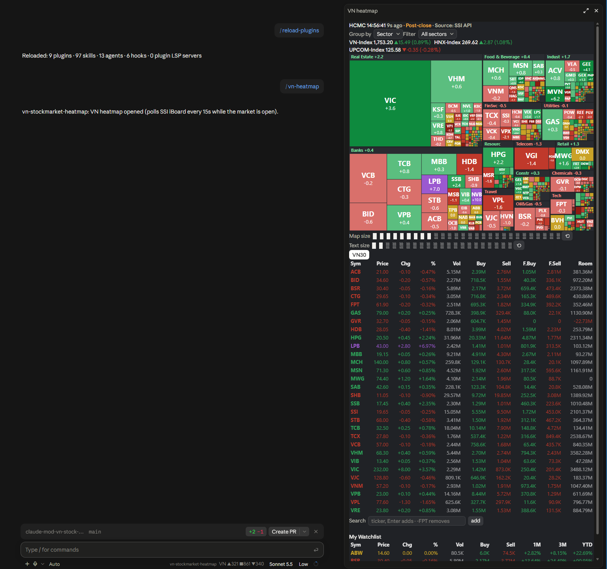
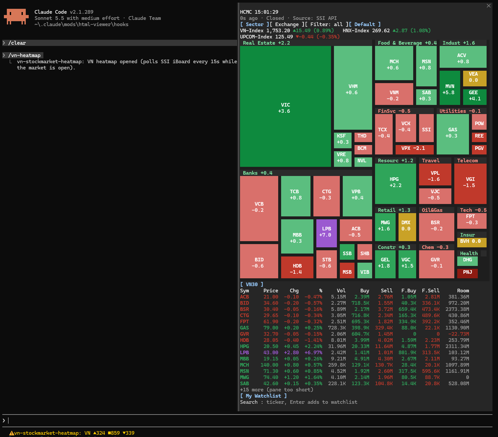

# VN Stock Heatmap — Claude Code mod

| Desktop app | Terminal |
| :---: | :---: |
|  |  |
| SVG treemap and zoomable tables, map-size and text-size sliders, clickable buttons | Cell-grid treemap and text tables, keyboard hotkeys, mouse-wheel zoom |
Live Vietnam stock-market heatmap (SSI iBoard data) in a Claude Code pane, with a VN30 table, watchlist and portfolio. Works in the **terminal** (`claude`) and the **Claude Code desktop app**. No API key, no dependencies, no build step.

## Install

### Via `/plugin` (marketplace)

In Claude Code (terminal or desktop):

```
/plugin marketplace add NgoTuong12345/claude-mod-vn-stock-watch
/plugin install vn-stockmarket-heatmap@vn-stock-watch
/reload-plugins
```

Then run `/vn-heatmap`. State is still saved to `~/.claude/state/`. Update with `/plugin marketplace update vn-stock-watch`.

### Manual clone

Manual clone: the mod must live at `~/.claude/mods/vn-stockmarket-heatmap` (on Windows: `%USERPROFILE%\.claude\mods\vn-stockmarket-heatmap`). The folder name matters: state is saved to `~/.claude/state/`, two levels up from the mod.

```bash
git clone https://github.com/NgoTuong12345/claude-mod-vn-stock-watch.git ~/.claude/mods/vn-stockmarket-heatmap
```

### Install via a coding agent

Paste this into Claude Code (terminal or desktop), or any coding agent with shell access:

> Clone `https://github.com/NgoTuong12345/claude-mod-vn-stock-watch.git` into `~/.claude/mods/vn-stockmarket-heatmap` (create `~/.claude/mods` if missing; on Windows use `%USERPROFILE%\.claude\mods`). Keep that exact folder name. Do not run a build, there is none. Then run `claude plugin validate ~/.claude/mods/vn-stockmarket-heatmap` and report the result. Finally tell me to run `/reload-plugins` and then `/vn-heatmap`.

To update later: `git -C ~/.claude/mods/vn-stockmarket-heatmap pull`, then `/reload-plugins`.

## Enable `/vn-heatmap`

A mod in `~/.claude/mods/` is picked up by Claude Code, but a running session only loads it on request:

1. In the Claude Code prompt (terminal or desktop) run `/reload-plugins`. A new session picks it up by itself.
2. Run `/vn-heatmap`. The pane opens and starts polling SSI iBoard.

Re-run `/reload-plugins` after every code change or `git pull`. If `/vn-heatmap` is not found, run `/reload-plugins` again and check that `claude plugin validate ~/.claude/mods/vn-stockmarket-heatmap` passes and the folder name is exact.

To try it without installing into `mods/`: `claude --plugin-dir /path/to/vn-stockmarket-heatmap`.

## Use

Both surfaces: sector/exchange views (desktop: "Group by" and multi-select "Filter" dropdowns: each pick toggles a sector, chips remove them), sector filter, index strip (VN-Index, HNX-Index, UPCOM-Index), VN30 table, watchlist table with 1M/3M/YTD returns, foreign buy/sell volume and remaining room (F.Buy, F.Sell, Room), and a **Remove** row with one button per watchlist ticker. Price changes flash the whole row until the next poll.

- Add a ticker: type `FPT` in the search box and press Enter (a partial code like `FP` takes the top suggestion). Remove: `-FPT`, or press its button in the Remove row.
- Portfolio (terminal): open the My Watchlist tab and type `FPT 1000 62.4` (quantity, cost in thousand VND). It shows value, P&L and a total row.
- Watchlist and portfolio persist in `~/.claude/state/vn-heatmap.json`.

**Terminal:** hotkeys `s`/`e` (sector/exchange), `f` (cycle sector filter), `d` (reset). Mouse wheel over the treemap zooms it.

**Desktop:** the treemap is an SVG sized to the pane.
- Map size: click a bar in the "Map size" slider; `⟲` resets to auto. (The desktop host gives plugins no pointer drag, so it is click-to-set, not draggable.)
- Text size: click a bar in the "Text size" slider (12–32px, 1px steps; `⟲` resets). Zoom in far enough and the VN30 table splits into two side-by-side tables.

## Layout

```
.claude-plugin/plugin.json   plugin manifest
hooks/                       mod source (index.tsx, watch.ts, treemap.ts, svgmap.ts, types.d.ts, hooks.json)
tests/                       self-checks (watch.check.ts, watch.test.tsx)
docs/ssi-iboard-api.md       data-source API notes
```

## Test

```bash
bun tests/watch.check.ts                       # parse/apply/suggest logic; also hits live SSI
claude plugin validate ~/.claude/mods/vn-stockmarket-heatmap
```

(`.claude-plugin/types/` is generated by Claude Code for type-checking and is not committed.)

## Troubleshooting

- Pane says "Nothing to show yet": the render was refused or failed. Check `~/.claude/state/vn-heatmap.err.log` and the dim `ui.render (Pane) refused:` line in the transcript.
- No data / `SSI error`: SSI iBoard rate-limits (HTTP 429). It retries on the next poll.
- Prices outside Mon–Fri 09:00–15:00 (UTC+7) are the last close; polling slows down while the market is closed.

## License

MIT
